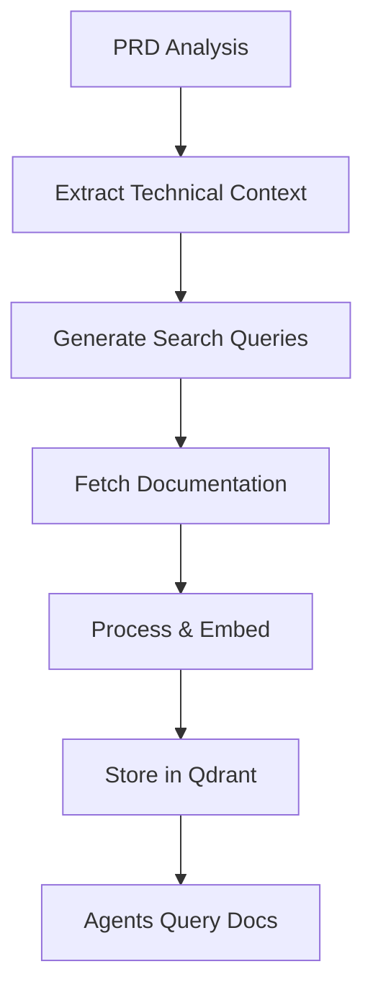

# Documentation Knowledge Base Guide

## Overview

This guide explains how to build and maintain a technical documentation knowledge base in Qdrant that BMAD agents can query for the latest documentation, code examples, and best practices.

## Workflow Overview



## Step 1: Generate Technical Search Tools

Instead of using the basic `generate-search-tools.js`, use the enhanced version:

```bash
node {root}/scripts/generate-tech-search-tools.js --prd docs/prd.md --output tech-search-tools.yaml
```

This will:
- Extract specific technologies (React, PostgreSQL, etc.)
- Identify required features and integrations
- Generate targeted documentation queries
- Create a Qdrant ingestion plan

### Example Output Structure

```yaml
project_context:
  frameworks: [react, express, nextjs]
  databases: [postgresql, redis]
  languages: [typescript, javascript]
  features:
    - "user authentication with JWT"
    - "real-time notifications"
    - "file upload to S3"

documentation_queries:
  documentation_searches:
    - query: "react official documentation 2024"
      source: google
      intent: "Find latest official docs"
    - query: "postgresql schema design patterns"
      source: official_docs
      intent: "Database design guidance"
  
  code_examples:
    - query: "react typescript production example 2024"
      source: github
      intent: "Find real-world implementations"
```

## Step 2: Fetch Documentation

### Option A: Manual Collection
1. Review the generated queries
2. Visit official documentation sites
3. Copy relevant sections
4. Save as markdown files

### Option B: Automated Fetching (Recommended)
```bash
# Use a documentation fetcher script
node scripts/fetch-documentation.js --input tech-search-tools.yaml --output docs/fetched/
```

### Documentation Sources Priority

1. **Official Documentation**
   - Always prefer official docs (React.dev, Angular.io, etc.)
   - Look for latest stable version docs
   - Focus on core concepts and API references

2. **GitHub Examples**
   - Search for repos with >100 stars
   - Look for "awesome-{technology}" lists
   - Check recently updated projects

3. **Technical Blogs**
   - Medium, Dev.to for tutorials
   - Stack Overflow for troubleshooting
   - Corporate engineering blogs for best practices

## Step 3: Process and Structure Documentation

### Content Structure
```json
{
  "id": "react-hooks-useState",
  "technology": "react",
  "category": "hooks",
  "title": "useState Hook",
  "content": "The useState hook allows you to add state to functional components...",
  "code_examples": [
    {
      "description": "Basic counter example",
      "code": "const [count, setCount] = useState(0);"
    }
  ],
  "source": "https://react.dev/reference/react/useState",
  "version": "18.2",
  "last_updated": "2024-01-15",
  "tags": ["react", "hooks", "state-management"]
}
```

### Chunking Strategy
- Split documentation into semantic sections
- Keep code examples with their explanations
- Maintain context in each chunk
- Ideal chunk size: 500-1000 tokens

## Step 4: Ingest into Qdrant

### Create Collections

```javascript
// Create specialized collections
const collections = {
  'project_documentation': {
    vectors: { size: 1536, distance: 'Cosine' },
    payload_schema: {
      technology: 'keyword',
      category: 'keyword',
      version: 'keyword',
      last_updated: 'datetime'
    }
  },
  'code_examples': {
    vectors: { size: 1536, distance: 'Cosine' },
    payload_schema: {
      language: 'keyword',
      framework: 'keyword',
      pattern: 'keyword'
    }
  },
  'best_practices': {
    vectors: { size: 1536, distance: 'Cosine' },
    payload_schema: {
      technology: 'keyword',
      practice_type: 'keyword'
    }
  }
};
```

### Run Ingestion

```bash
node scripts/ingest-to-qdrant.js \
  --input docs/processed/ \
  --collection project_documentation \
  --embeddings-model openai
```

## Step 5: Agent Integration

### Querying Documentation

Agents can query documentation using the `query-technical-docs` task:

```yaml
# In agent commands
- command: check-docs
  description: "Query technical documentation"
  action: Execute task `query-technical-docs` with query='{{user_query}}'
```

### Example Agent Usage

```javascript
// Dev agent querying React hooks documentation
const docs = await executeTask('query-technical-docs', {
  query: 'How to use useEffect with cleanup',
  technology: 'react',
  limit: 3
});

// QA agent checking best practices
const practices = await executeTask('query-technical-docs', {
  query: 'PostgreSQL indexing best practices',
  technology: 'postgresql',
  limit: 5
});
```

## Step 6: Maintenance

### Update Schedule
- **Weekly**: Official documentation updates
- **Monthly**: Code examples and blog posts
- **Quarterly**: Full re-indexing

### Update Process
```bash
# 1. Generate fresh queries
node scripts/generate-tech-search-tools.js --prd docs/prd.md

# 2. Fetch new documentation
node scripts/fetch-documentation.js --update-existing

# 3. Re-ingest updated docs
node scripts/ingest-to-qdrant.js --update
```

## Best Practices

### 1. Documentation Quality
- Verify documentation is from authoritative sources
- Check documentation date (prefer recent)
- Include version information
- Keep original source URLs

### 2. Embedding Strategy
- Use consistent embedding model
- Consider hybrid search (vector + keyword)
- Implement metadata filtering
- Cache frequently accessed docs

### 3. Query Optimization
- Pre-process agent queries for better matches
- Use technology-specific collections
- Implement relevance feedback
- Track query performance

## Troubleshooting

### Common Issues

1. **Low Quality Results**
   - Check if embeddings model matches ingestion
   - Verify chunk size isn't too large/small
   - Review metadata filtering

2. **Outdated Documentation**
   - Set up automated update schedule
   - Monitor documentation sources for changes
   - Version-tag all documentation

3. **Slow Queries**
   - Implement caching layer
   - Optimize collection indices
   - Use filtered searches

## Example: Complete Setup for React Project

```bash
# 1. Analyze PRD and generate searches
node scripts/generate-tech-search-tools.js --prd docs/prd.md

# 2. Fetch React documentation
curl -L https://react.dev/reference/react > docs/fetched/react-reference.md
curl -L https://react.dev/learn > docs/fetched/react-learn.md

# 3. Process documentation
node scripts/process-documentation.js \
  --input docs/fetched/ \
  --output docs/processed/ \
  --chunk-size 800

# 4. Ingest to Qdrant
node scripts/ingest-to-qdrant.js \
  --input docs/processed/ \
  --collection project_documentation

# 5. Test queries
node -e "
const { executeTask } = require('./task-executor');
executeTask('query-technical-docs', {
  query: 'React hooks useState and useEffect',
  limit: 3
}).then(console.log);
"
```

## Integration with BMAD Workflow

### Planning Phase
- Analyst uses documentation to verify technical feasibility
- Architect queries best practices for design decisions

### Development Phase
- Dev queries implementation examples
- QA checks documentation for testing strategies

### Benefits
- Always up-to-date technical reference
- Consistent implementation patterns
- Reduced external search time
- Better code quality through best practices

This documentation knowledge base ensures all BMAD agents have access to the latest, most relevant technical documentation for your project's technology stack.