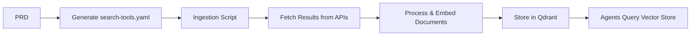

# Search Tools Guide

This guide provides comprehensive documentation for the BMad search tools feature, which automatically generates search queries from PRDs to support retrieval-augmented development.

## File Locations

- **Structured Task Definition**: `bmad-core/structured-tasks/generate-search-tools.yaml`
- **Tool Mappings Configuration**: `bmad-core/data/tool-mappings.yaml`
- **Generation Script**: `scripts/generate-search-tools.js`
- **Ingestion Script**: `scripts/ingest-to-qdrant.js`
- **Validation Script**: `scripts/validate-search-tools.js`

## Overview

The search tools feature extracts domain-specific keywords from your Product Requirements Document (PRD) and generates targeted search queries for external documentation sources. This helps developers find relevant libraries, code examples, and API documentation during implementation.

## How Search Tools Work

### 1. Generation Process

The search tools can be generated in two ways:

#### Using the Structured Task (Recommended for BMad Agents)
The structured task at `bmad-core/structured-tasks/generate-search-tools.yaml` can be executed by BMad agents:
```yaml
task: generate-search-tools
inputs:
  prdPath: docs/prd.md  # or docs/prd for sharded PRDs
  mappingsPath: bmad-core/data/tool-mappings.yaml
outputs:
  searchToolsFile: search-tools.yaml
```

#### Using the NPM Script (For Direct Execution)
```bash
npm run generate:search-tools
```

When you run the search tools generator:

1. **Keyword Extraction**: The system analyzes your PRD to identify technical terms and domain keywords
2. **Mapping**: Keywords are mapped to appropriate search providers using `bmad-core/data/tool-mappings.yaml`
3. **Query Generation**: Concrete search queries are generated by replacing placeholders in query templates
4. **Output**: A `search-tools.yaml` file is created with structured search entries

### 2. File Format

The generated `search-tools.yaml` file contains an array of search tool entries:

```yaml
searchTools:
  - name: github
    query: "express authentication middleware"
    repository: null
    description: "Search for authentication libraries on GitHub"
  - name: npmjs
    query: "passport jwt strategy"
    description: "Search for JWT authentication packages on npm"
  - name: stripe-api-docs
    query: "payment subscription billing"
    description: "Search Stripe documentation for subscription billing"
```

Each entry contains:
- `name`: The search provider identifier
- `query`: The generated search query
- `repository` (optional): Specific repository to search within
- `description` (optional): Human-readable description of the search intent

## Ingesting Search Results into Qdrant

### Using the Ingestion Script

BMad includes a script to execute searches and ingest results into Qdrant:

```bash
# Basic usage
node scripts/ingest-to-qdrant.js

# With custom options
node scripts/ingest-to-qdrant.js \
  --input search-tools.yaml \
  --collection search-results \
  --qdrant-url http://localhost:6333

# Dry run to see what would be ingested
node scripts/ingest-to-qdrant.js --dry-run
```

### Script Options

- `--input <path>`: Path to search tools file (default: search-tools.yaml)
- `--collection <name>`: Qdrant collection name (default: search-results)
- `--qdrant-url <url>`: Qdrant server URL (default: http://localhost:6333)
- `--dry-run`: Preview what would be ingested without executing

### What the Script Does

1. **Reads search-tools.yaml**: Parses the generated search queries
2. **Executes searches**: Runs each query against its designated provider
3. **Processes results**: Normalizes and structures the search results
4. **Generates embeddings**: Creates vector representations of the content
5. **Stores in Qdrant**: Saves results with metadata for retrieval

**Note**: The current implementation is a stub that demonstrates the workflow. To fully implement:
- Add API clients for each search provider (GitHub, npm, etc.)
- Implement authentication where required
- Add embedding generation using your preferred model
- Configure Qdrant client with proper connection settings

## How Agents Use search-tools.yaml During Development

### 1. Context Enhancement

BMad agents can reference the search-tools.yaml file to:

- **Developer Agent**: Uses search queries to find implementation examples and best practices
- **Architect Agent**: Researches architectural patterns and library comparisons
- **QA Agent**: Finds testing strategies and security considerations for the technologies

### 2. Integration with RAG (Retrieval-Augmented Generation)

When properly integrated with a vector database like Qdrant:

1. **Pre-Development Phase**: 
   - Search queries are executed against external APIs
   - Results are fetched and embedded into vector storage
   - Agents query the vector store during planning and implementation

2. **During Development**:
   - Agents can request specific searches based on the pre-generated queries
   - Results provide context-aware code examples and documentation
   - Reduces hallucination by grounding responses in actual documentation

### 3. Manual Usage

Developers can also manually use the generated queries:

```bash
# View generated search queries
cat search-tools.yaml

# Copy a query and search manually on the respective platform
# Example: Copy "express authentication middleware" and search on GitHub
```

## What Happens with Search Results After Generation

### Current State

1. **Query Generation Only**: The current implementation generates search queries but doesn't execute them
2. **Manual Execution**: Developers need to manually run searches or implement ingestion
3. **Future Integration**: Planned Qdrant ingestion script will automate the retrieval process

### Planned Workflow



### Interim Usage

Until automated ingestion is available:

1. **Review Generated Queries**: Examine search-tools.yaml to understand what external resources are relevant
2. **Priority Searches**: Manually execute high-priority searches for critical features
3. **Document Findings**: Store important findings in project documentation for agent access

## Supported Search Providers

### Currently Supported Providers

The system includes mappings for these search providers in `bmad-core/data/tool-mappings.yaml`:

1. **Code Repositories**
   - `github`: GitHub code search
   - `gitlab`: GitLab repository search

2. **Package Registries**
   - `npmjs`: npm package registry
   - `pypi`: Python Package Index
   - `crates`: Rust crates registry
   - `maven`: Maven Central for Java
   - `nuget`: .NET package registry

3. **API Documentation**
   - `stripe-api-docs`: Stripe payment API
   - `twilio-docs`: Twilio communication API
   - `aws-docs`: AWS service documentation
   - `google-cloud-docs`: Google Cloud documentation

4. **Community Resources**
   - `stackoverflow`: Programming Q&A
   - `devto`: Developer articles
   - `medium-tech`: Technical blog posts

5. **Framework Documentation**
   - `react-docs`: React documentation
   - `vue-docs`: Vue.js documentation
   - `angular-docs`: Angular documentation
   - `django-docs`: Django documentation
   - `rails-docs`: Ruby on Rails guides

### Adding New Search Providers

To add support for new search providers:

#### 1. Update tool-mappings.yaml

Edit `bmad-core/data/tool-mappings.yaml` to add new keyword mappings:

```yaml
keywordMappings:
  # Existing mappings...
  
  # Add new domain keyword
  blockchain:
    - name: ethereum-docs
      queryTemplate: "{{keyword}} smart contract"
      description: "Search Ethereum documentation"
    - name: web3js
      queryTemplate: "{{keyword}} web3"
      description: "Search for Web3.js examples"
```

#### 2. Add Provider-Specific Templates

For providers with special query formats:

```yaml
# Custom provider with specific query structure
providerTemplates:
  ethereum-docs:
    baseUrl: "https://ethereum.org/search"
    queryFormat: "site:ethereum.org {{query}}"
    
  arxiv:
    baseUrl: "https://arxiv.org/search"
    queryFormat: "all:{{query}} AND cat:cs.AI"
```

#### 3. Configure Default Mappings

Add entries to the `defaultMappings` section for unmapped keywords:

```yaml
defaultMappings:
  # Existing defaults...
  
  # Add new default provider
  - name: arxiv
    queryTemplate: "{{keyword}} machine learning"
    description: "Search academic papers on arXiv"
```

### Best Practices for Adding Providers

1. **Specificity**: Make query templates specific to the provider's strengths
2. **Keywords**: Choose keywords that align with the provider's domain expertise
3. **Templates**: Use `{{keyword}}` placeholder for dynamic substitution
4. **Descriptions**: Add clear descriptions to help users understand the search intent

### Example: Adding a Custom Internal Documentation Provider

```yaml
keywordMappings:
  internal-api:
    - name: confluence
      queryTemplate: "{{keyword}} API specification"
      description: "Search internal Confluence documentation"
      metadata:
        requiresAuth: true
        baseUrl: "https://company.atlassian.net/wiki/search"
```

## Advanced Usage

### Customizing Search Generation

You can customize the search generation process:

```bash
# Use custom mappings file
npm run generate:search-tools -- --mappings custom-mappings.yaml

# Generate for specific PRD section
npm run generate:search-tools -- --prd docs/prd/epic-1.md

# Output to different location
npm run generate:search-tools -- --output outputs/search-queries.yaml
```

### Integrating with CI/CD

Add search generation to your workflow:

```yaml
# .github/workflows/bmad.yml
- name: Generate Search Tools
  run: npm run generate:search-tools
  
- name: Upload Search Queries
  uses: actions/upload-artifact@v3
  with:
    name: search-tools
    path: search-tools.yaml
```

### Filtering and Prioritizing Searches

For large projects, you may want to filter searches:

1. **By Provider**: Focus on specific providers relevant to your stack
2. **By Keyword**: Prioritize searches for critical features
3. **By Frequency**: Execute most common searches first

## Troubleshooting

### Common Issues

1. **No keywords extracted**: Ensure your PRD contains technical terms and isn't too generic
2. **Missing mappings**: Add domain-specific mappings to bmad-core/data/tool-mappings.yaml
3. **Duplicate queries**: The system automatically deduplicates, but check for variations

### Debug Mode

Run with verbose output to debug issues:

```bash
# This will show keyword extraction and mapping process
node scripts/generate-search-tools.js --prd docs/prd.md --verbose
```

## Future Enhancements

### Planned Features

1. **Automatic Ingestion**: Script to execute searches and store results
2. **Provider APIs**: Direct integration with GitHub, npm, and other APIs
3. **Ranking**: Smart ranking of search results based on relevance
4. **Caching**: Local caching of search results to reduce API calls
5. **Real-time Updates**: Periodic re-execution of searches for updated documentation

### Qdrant Integration (Coming Soon)

The planned Qdrant integration will:

1. Execute all searches from search-tools.yaml
2. Fetch and process documentation pages
3. Generate embeddings using appropriate models
4. Store in Qdrant with metadata for efficient retrieval
5. Provide query interface for agents

Stay tuned for updates on the automated ingestion feature!