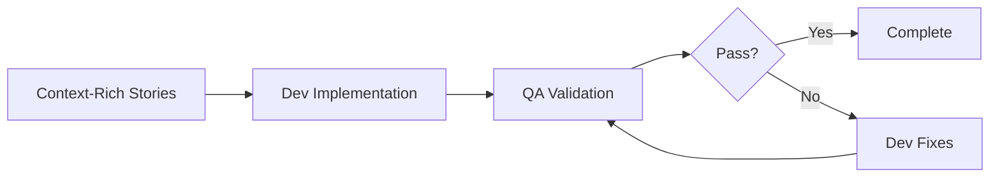

# Two-Phase Workflow

The SEMAD Method implements a revolutionary two-phase workflow that separates planning from execution, ensuring comprehensive context and clear requirements before any code is written.

## Overview

The two-phase workflow consists of:

1. **Planning Phase** - Requirements gathering, analysis, and architecture design
2. **Development Phase** - Implementation, testing, and validation

This separation ensures that development teams (whether human or AI) have complete context and clear specifications before beginning implementation.

## Phase 1: Planning

### Participants
- **Product Owner (PO)** - Defines business requirements
- **Analyst** - Refines and clarifies requirements
- **Product Manager (PM)** - Creates comprehensive PRD
- **Architect** - Designs technical architecture

### Workflow


### Key Outputs
1. **Product Requirements Document (PRD)**
   - Executive summary
   - Problem statement
   - Solution overview
   - Core features
   - Success metrics

2. **Architecture Document**
   - Technical stack decisions
   - System design
   - Component architecture
   - Integration points
   - Security considerations

### Benefits of Planning Phase
- Clear requirements before implementation
- Reduced rework and technical debt
- Better resource allocation
- Comprehensive documentation
- Stakeholder alignment

## Phase 2: Development

### Participants
- **Scrum Master (SM)** - Creates implementation stories
- **Developer (Dev)** - Implements features
- **Quality Assurance (QA)** - Validates implementation

### Workflow



### Story Structure

Each story contains:
- **Context** - Full background from planning phase
- **Requirements** - Clear acceptance criteria
- **Technical Specifications** - Implementation details
- **Dependencies** - Related components and APIs
- **Test Cases** - Validation criteria

### Development Cycle

1. **Story Selection**
   ```bash
   /sm *create-next-story
   ```

2. **Implementation**
   ```bash
   /dev *implement-next-story
   ```

3. **Validation**
   ```bash
   /qa *validate-implementation
   ```

4. **Iteration** (if needed)
   - QA provides feedback
   - Dev addresses issues
   - Cycle continues until acceptance

## Context Preservation

The key innovation of the two-phase workflow is **context preservation**:

### Traditional Approach Problems
- Context loss between planning and development
- Misinterpretation of requirements
- Incomplete specifications
- Knowledge silos

### SEMAD Solution
- All planning artifacts are preserved
- Stories contain complete context
- No information loss between phases
- Full traceability

## Workflow Variants

### Greenfield Projects
Starting from scratch with full planning phase:
- Complete PRD development
- Comprehensive architecture design
- Story creation from requirements

### Brownfield Projects
Working with existing codebases:
- Analysis of current system
- Incremental planning
- Refactoring considerations
- Legacy system integration

## Configuration

Configure workflows in `bmad-core/workflows/`:

```yaml
# development-phase.yaml
workflow:
  name: Development Phase
  phases:
    - planning:
        agents: [analyst, pm, architect]
        outputs: [prd, architecture]
    - development:
        agents: [sm, dev, qa]
        outputs: [stories, code, tests]
```

## Best Practices

### For Planning Phase
1. **Be Comprehensive** - Include all relevant details
2. **Think Ahead** - Consider future scalability
3. **Document Decisions** - Explain the "why"
4. **Get Stakeholder Buy-in** - Align early

### For Development Phase
1. **Follow the Story** - Don't deviate from specifications
2. **Test Early** - Validate as you go
3. **Communicate Issues** - Flag blockers immediately
4. **Maintain Context** - Reference planning documents

## Metrics and Success

### Planning Phase Metrics
- Requirement clarity score
- Stakeholder approval rate
- Architecture completeness
- Time to approval

### Development Phase Metrics
- Story completion rate
- First-pass QA success rate
- Bug density
- Velocity trends

## Common Patterns

### Pattern 1: Feature Addition
1. PO defines new feature need
2. Analyst clarifies requirements
3. PM updates PRD
4. Architect extends design
5. SM creates implementation stories
6. Dev implements incrementally
7. QA validates each increment

### Pattern 2: Bug Fix
1. QA identifies issue
2. SM creates fix story with context
3. Dev implements fix
4. QA validates resolution

### Pattern 3: Refactoring
1. Architect identifies technical debt
2. PM prioritizes refactoring
3. SM creates refactoring stories
4. Dev implements improvements
5. QA ensures no regression

## Troubleshooting

### Issue: Context Loss
**Solution**: Review planning documents, ensure stories contain full context

### Issue: Unclear Requirements
**Solution**: Loop back to analyst for clarification

### Issue: Implementation Doesn't Match Design
**Solution**: QA flags early, dev reviews architecture document

## Related Topics

- [Context Engineering](context-engineering.md)
- [Story-Driven Development](story-driven-development.md)
- [Agent Architecture](agent-architecture.md)
- [Workflow Patterns](../workflows/patterns.md)